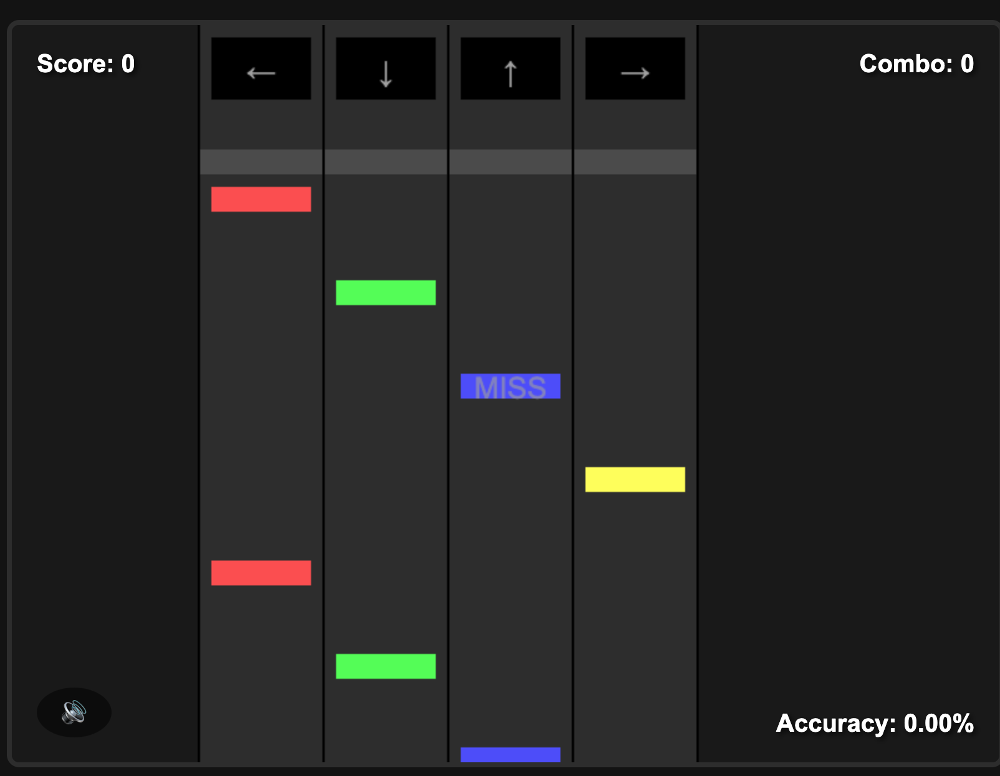

# Rhythm Battle 🎮 🎵

[](https://opensource.org/licenses/MIT)
[](https://developer.mozilla.org/en-US/docs/Web/JavaScript)
[](https://developer.mozilla.org/en-US/docs/Web/Guide/HTML/HTML5)
[](https://developer.mozilla.org/en-US/docs/Web/CSS)
[](https://windsurf.ai)

A rhythm-based game inspired by Friday Night Funkin', built with JavaScript and HTML5 Canvas. Test your reflexes and rhythm as you press arrow keys in time with the music!



## 🎯 Features

- **Four-lane rhythm gameplay** similar to Friday Night Funkin'
- **Arrow key controls** for intuitive gameplay
- **Timing-based scoring system** (Perfect, Good, Okay, Miss)
- **Combo system** that increases your score multiplier
- **Complete audio experience** with sound effects and background music
- **Vertical scrolling notes** that travel from bottom to top
- **Visual feedback** for hits and misses
- **Responsive design** that works on various screen sizes

## 🎮 How to Play

1. Press the START GAME button to begin
2. Press the corresponding arrow keys when notes reach the target zone
3. Try to hit notes with perfect timing for maximum points
4. Build combos to increase your score multiplier

### Controls

- ← Left Arrow: Left lane
- ↓ Down Arrow: Left-center lane
- ↑ Up Arrow: Right-center lane
- → Right Arrow: Right lane

## 🚀 Quick Start

```bash
# Clone the repository
git clone https://github.com/mVara/rhythm-battle.git

# Navigate to the project directory
cd rhythm-battle

# Open the game in your browser
open index.html
```

Alternatively, you can serve the game using a local server:

```bash
# Using Python
python -m http.server 8000

# Using Node.js (with http-server)
npx http-server
```

Then open your browser and navigate to `http://localhost:8000` or `http://localhost:8080`.

## 🛠️ Technologies

- **HTML5 Canvas** for rendering the game
- **Vanilla JavaScript** for game logic
- **CSS3** for styling
- **Web Audio API** for sound management

## 🎵 Sound Credits

Sound effects from Freesound.org:
- 8-Bit Sound Effects Library by LittleRobotSoundFactory (CC BY 3.0)
- 8bit-harmony by electrobuz (CC BY 3.0)

## 🧠 Implementation Details

The game is built using a simple yet effective architecture:

- **Game Loop**: Manages the update and render cycles
- **Note System**: Controls the spawning and movement of notes
- **Input Handler**: Processes keyboard inputs and timing
- **Scoring System**: Calculates score based on timing accuracy
- **Audio Manager**: Handles sound effects and background music

## 🔮 Future Enhancements

- Add character animations
- Implement multiple songs and difficulty levels
- Add custom beatmap creation
- Improve visual effects and feedback
- Add multiplayer functionality

## 📝 License

This project is licensed under the MIT License - see the [LICENSE](LICENSE) file for details.

## 👤 Author

**Jack C Crawford** - *Initial work*

## 🙏 Acknowledgments

- Inspiration from Friday Night Funkin'
- Built with assistance from [Windsurf.ai](https://windsurf.ai)
- Sound effects from [Freesound.org](https://freesound.org)
