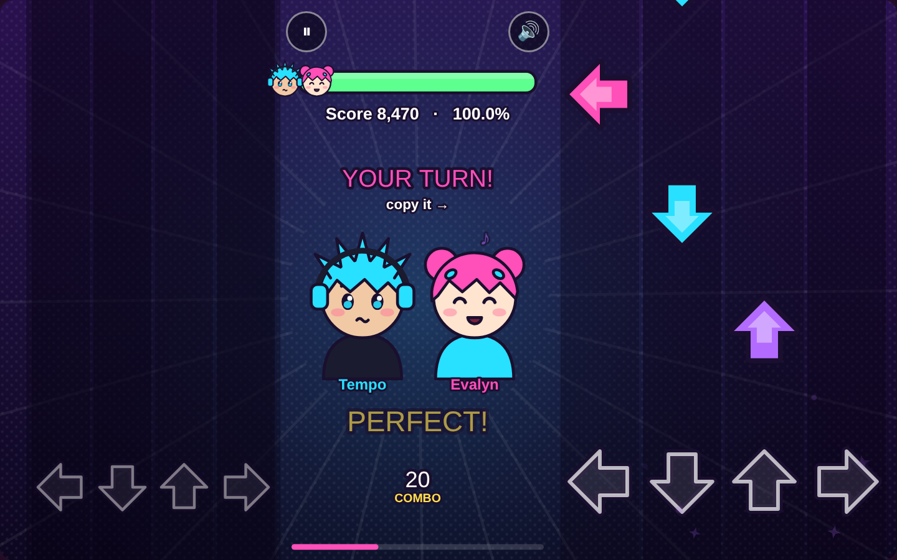
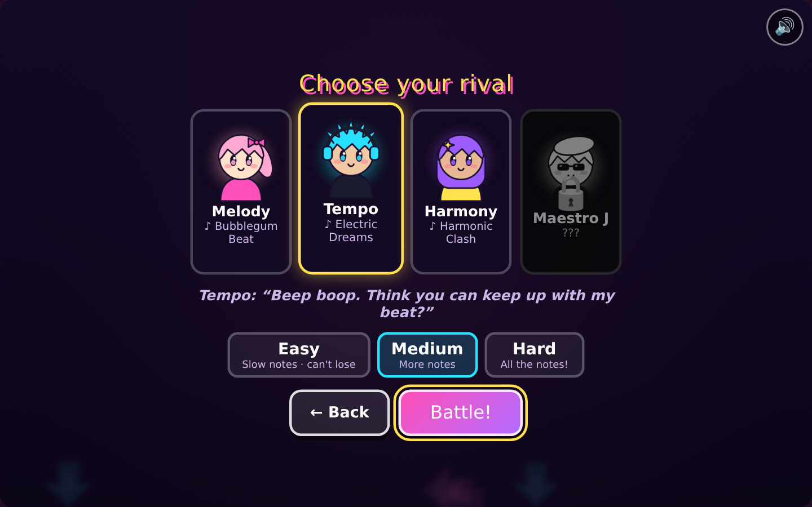

# Rhythm Battle 🎮 🎵

[](https://opensource.org/licenses/MIT)
[](https://developer.mozilla.org/en-US/docs/Web/JavaScript)
[](https://developer.mozilla.org/en-US/docs/Web/Guide/HTML/HTML5)

**Evalyn's Game**: a call-and-response rhythm battle inspired by Friday Night Funkin'. Your rival sings a pattern, then you copy it note for note. Every arrow you hit plays part of the melody, so a good run sounds like a duet.



## 🎯 Features

- **Call and response.** Watch the rival's arrows on the left, then copy them on the right. Kids learn each pattern by seeing and hearing it first.
- **Four rivals to unlock:** Melody, Tempo, Harmony and the secret boss, Maestro J. Each has their own song, look and lines.
- **Music that stays in time.** The band, the rival's voice and your notes all run on the Web Audio clock. Notes land on the beat, and the game plays the same on 60Hz and 120Hz screens.
- **Three difficulties.** Easy uses slow notes on the beat only, with generous timing, and **you can't lose**. Medium adds 8th notes. Hard adds 16ths and double notes.
- **Plays on tablets and phones.** Tap the lanes, with multi-touch for double notes. The layout adapts to portrait and landscape.
- **Keyboard:** arrow keys or WASD. <kbd>Esc</kbd> or <kbd>P</kbd> pauses, and the game pauses itself if you switch tabs. Resuming counts down 3-2-1.
- **Scoring:** grades from S+ to D, 1–3 stars, early/late hints, full-combo and new-best badges.
- **Progress is saved** in the browser: your name, unlocked rivals, best scores and settings.
- **Settings:** music and effects volume, notes falling down or rising up, screen shake on/off, and a timing offset for Bluetooth headphones.



## 🎮 How to Play

1. Type your name and press **Play**.
2. Pick a rival and a difficulty, then press **Battle!**
3. **Watch.** Your rival sings a pattern on the left.
4. **Copy it.** Hit each arrow on the right as it reaches its outline.
5. Push the health bar to your side (green) and survive to the end of the song to win.

| Lane | Keys |
| --- | --- |
| ← | Left arrow / A |
| ↓ | Down arrow / S |
| ↑ | Up arrow / W |
| → | Right arrow / D |

## 🚀 Quick Start

No build step and no dependencies. Open `index.html` in a browser:

```bash
git clone https://github.com/jackccrawford/rhythm-battle.git
cd rhythm-battle
open index.html          # or double-click it
```

Or serve it locally, which is handy for playing on a tablet on the same Wi-Fi:

```bash
python3 -m http.server 8000
# then visit http://<your-computer's-ip>:8000
```

## 🛠️ How it's built

| File | What it does |
| --- | --- |
| `songs.js` | The rivals, their songs and note charts. Charts are short text patterns, so they're easy to edit. |
| `audio.js` | A small synthesizer (drums, bass, chords, voices, sound effects) built on the Web Audio API. |
| `game.js` | Game loop, timing and judging, input, drawing (canvas), menus and saving. |
| `index.html`, `styles.css` | Menus and screens. |

### Writing your own song

Each rival's song in `songs.js` is a list of 8-beat phrases on a 16th-note grid, 4 characters per beat:

```js
'0... 1... 2..3 .... | 3... 2... 1..0 ....'
```

- `0` `1` `2` `3` are the ← ↓ ↑ → lanes, and `.` is a rest.
- `a` `b` `c` `d` are two lanes at once (←→, ↓↑, ←↓, ↑→).
- Easy keeps only the notes on the beat, Medium keeps 8th notes, and Hard keeps everything.
- Pitches follow the song's chords automatically (lanes play root, 3rd, 5th and octave), so any pattern you write will sound musical.

## 📝 License

This project is licensed under the MIT License. See the [LICENSE](LICENSE) file for details.

## 👤 Credits

**Jack C Crawford & Evalyn**: game design, characters and play-testing.

Inspired by Friday Night Funkin'.
